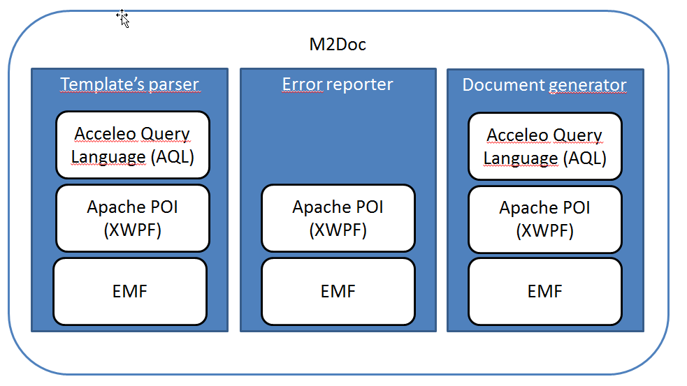

# M2Doc
The M2Doc technology enables the generation of [Office Open XML](https://fr.wikipedia.org/wiki/Office_Open_XML) documents from Ecore models.

The overall approach M2Doc implements consists in creating templates in the OOX format where static text authoring benefit from the WYSIWYG capabilities of the usual tools (e.g. Microsoft Word, Libre Office, Open Office). Dynamic parts are inserted using a dedicated vocabulary of OOX fields code. Fields are mainly used to insert page numbers, references, etc. M2Doc makes use them to describe documentation generation directives. This allows a total separation between the document and the M2Doc directives.

The template language makes an extensive use of the [Acceleo Query Language](https://www.eclipse.org/acceleo/documentation/aql.html) which provides a full fledged, extensible model query language and engine. 

## Functionalities
The following set of functionalities is currently supported :

* definition of an arbitrary number of model entries through a configuration model which allows to define the values of variables used in the template
* definition and registration of AQL services to be used in the template's queries
* generation of dynamic content in the document's header and footer
* generation of dynamic tables (which number of rows varies depending on the input model)
* a number of generation directives are already implemented :
  * iteration over a collection (obtained through an AQL query)
  * conditional generation (if/elseif/else/endif)
  * insertion of an image from a file
  * insertion of the evaluation result of an AQL query (as of now, a string representation of the result is inserted)

A complete documentation can be found [here](doc/doc/M2DocUserGuide.docx)

As a preview here follows a screen shot of a template's fragment and the corresponding generation result for a database. 

The generation results looks like this 

## Architecture 

The overall architecture of M2Doc is organized around three building blocs:
* Apache POI for the parsing and generation of OOXML documents
* AQL for querying the models
* EMF as a general platform

The workflow of M2Doc is depicted below: 

## Disclaimer 

Although it is already quite usable, the M2Doc technology isn't mature yet and needs being completed: in particular, the user interface and configuration model shouldn't be taken for granted.They may change as they were not the main focus of the first development sprint. 
The generation directive set must be completed as well and although the syntax shouldn't change beside these evolutions it might be the case that minor adjustments appear to be necessary in the near future. 

