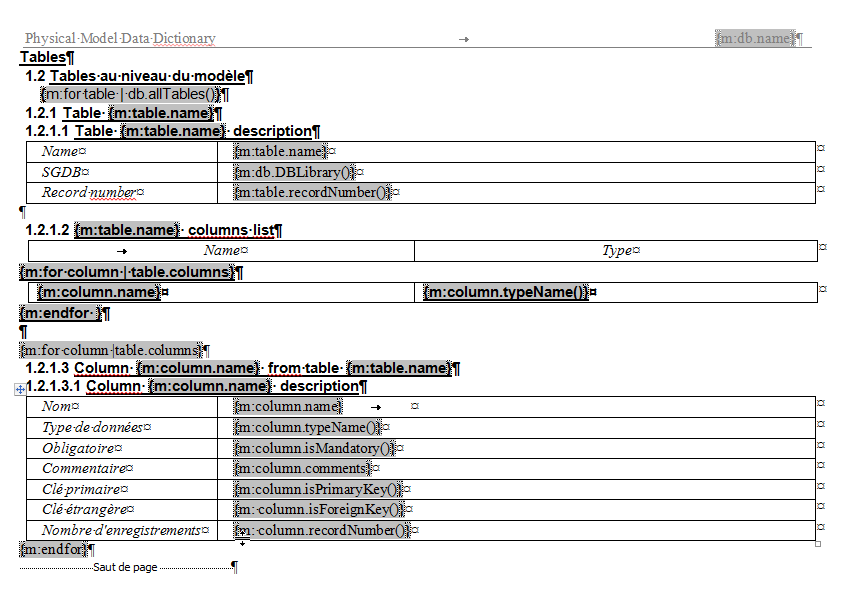
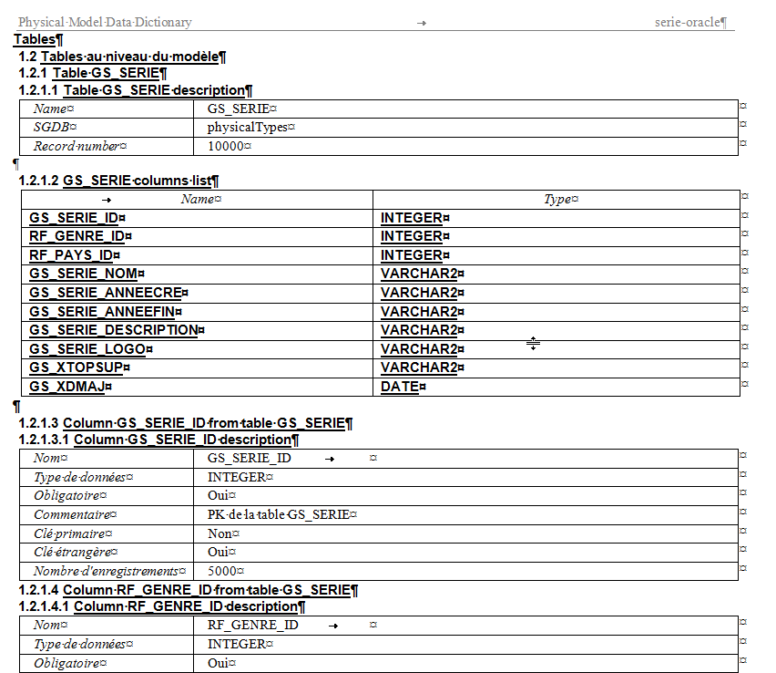
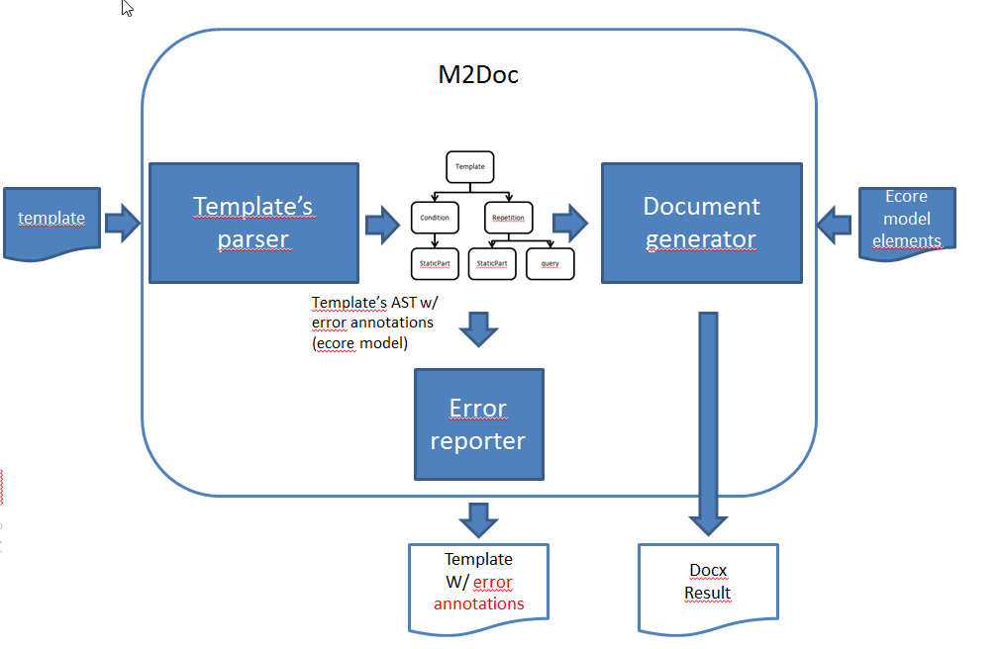

# M2Doc
The M2Doc technology enables the generation of [Office Open XML](https://fr.wikipedia.org/wiki/Office_Open_XML) documents from Ecore models.

The overall approach M2Doc implements consists in creating templates in the OOX format where static text authoring benefits from the WYSIWYG capabilities of the usual tools (e.g. Microsoft Word, Libre Office, Open Office). Dynamic parts are inserted using a dedicated vocabulary of OOX fields code. Fields are mainly used to insert page numbers, references, etc. M2Doc makes use them to describe documentation generation directives. This allows a total separation between the document and the M2Doc directives.

The template language makes an extensive use of the [Acceleo Query Language](https://www.eclipse.org/acceleo/documentation/aql.html) which provides a full fledged, extensible model query language and engine. 

## Functionalities
The following set of functionalities is currently supported :

* [Sirius](https://eclipse.org/sirius/) diagrams generation. With M2Doc, you can
  * insert a diagram into a document by specifying it's title through an AQL expression
  * select a subset of the layers defined in the diagram
* a number of generation directives are available to build documents from models:
  * iteration over a collection (obtained through an AQL query)
  * conditional generation (if/elseif/else/endif)
  * insertion of an image from a file
  * insertion of the evaluation result of an AQL query (as of now, a string representation of the result is inserted)
* generation of dynamic tables (which number of rows varies depending on the input model),
* generation of bookmarks and references to document parts,
* generation of dynamic content in the document's header and footer,
* definition of an arbitrary number of model entries through a configuration model which allows to define the values of variables used in the template
* definition and registration of AQL services to be used in the template's queries,
* static parts in the templates are produced as is in the generated documents. 

The sirius features are not mandatory and require a specific feature to be installed. 

## Documentation

The complete description of the functionalities can be found in the [User Guide](https://github.com/ObeoNetwork/M2Doc/blob/master/plugins/org.obeonetwork.m2doc.doc/doc/user/M2Doc%20User%20Guide.textile)

M2Doc is built around an open architecture that allows extensions to connect any modeling technology that provides representations and diagrams to M2Doc the way we did with Sirius. 

The proper way to achieve this is described in the [Developer Guide] (https://github.com/ObeoNetwork/M2Doc/blob/master/plugins/org.obeonetwork.m2doc.doc/doc/developer/M2Doc%20Developer%20Guide.textile)
##Example

As a preview here follows a screen shot of a template's fragment and the corresponding generation result for a database. 

The generation results looks like this 

## Architecture 

The overall architecture of M2Doc is organized around three building blocs:
* Apache POI for the parsing and generation of OOXML documents
* AQL for querying the models
* EMF as a general platform

The workflow of M2Doc is depicted below: 

## Download & Installation

Releases (update sites):
* [M2Doc 0.12.0](https://s3-eu-west-1.amazonaws.com/obeo-m2doc-releases/0.12.0/repository)
* [M2Doc 0.11.0](https://s3-eu-west-1.amazonaws.com/obeo-m2doc-releases/0.11.0/repository)
* [M2Doc 0.10.2](https://s3-eu-west-1.amazonaws.com/obeo-m2doc-releases/0.10.2/repository)
* [M2Doc 0.9.7](https://s3-eu-west-1.amazonaws.com/obeo-m2doc-releases/M2Doc_0.9.7/repository)
* [M2Doc 0.9.6](https://s3-eu-west-1.amazonaws.com/obeo-m2doc-releases/M2Doc_0.9.6/repository)
* [M2Doc 0.9.5](https://s3-eu-west-1.amazonaws.com/obeo-m2doc-releases/0.9.5)

Nighlty builds (update sites):
* [master branch](https://s3-eu-west-1.amazonaws.com/obeo-m2doc-releases/master/nightly/repository)

